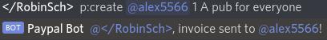
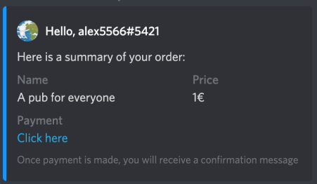
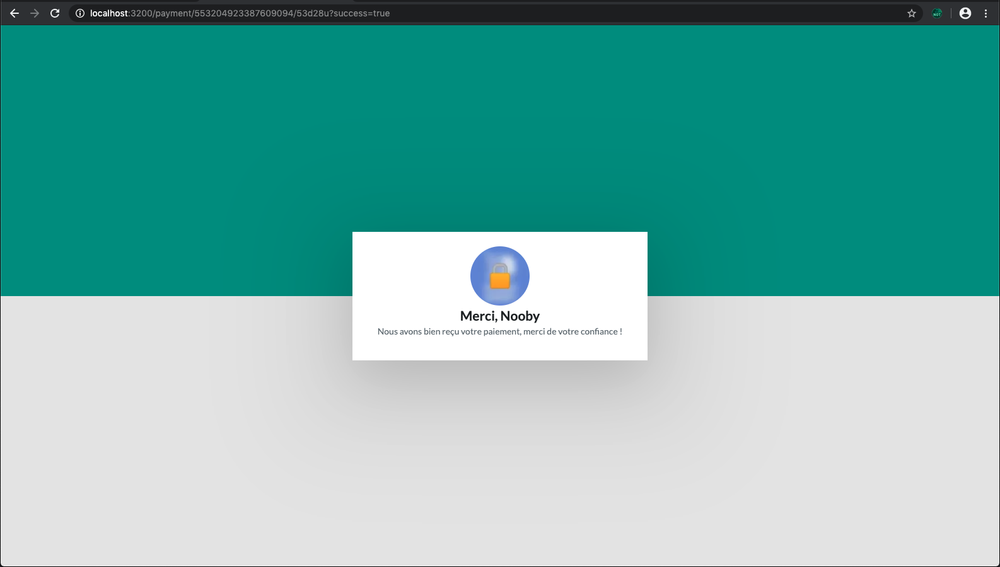
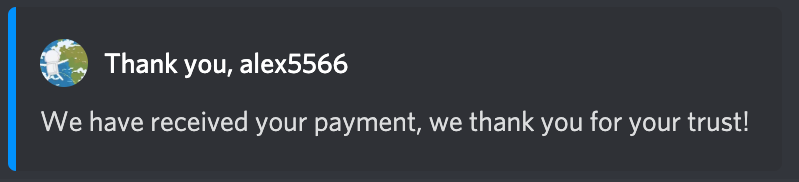
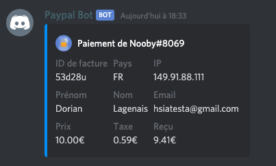

# Paypal Bot

## Étapes

### Générer la facture

Pour générer une facture, utilisez la commande `!create` sur Discord.
Utilisation : `!create [@user] [montant] [nom]`
> Seul l'ID de l'utilisateur défini dans la config en tant que propriétaire (DISCORD_OWNER) peut executer cette commande.

### Recevoir la facture

Une fois que la commande est tapée, l'utilisateur mentionné reçoit un message avec un lien pour payer:

## Payer la facture

Lorsque l'utilisateur clique sur ce lien, il est redirigé vers cette page avec son pseudo, son avatar, le nom de la facture et le bouton payer :

Lorsque l'utilisateur clique sur "Payer la commande", il est redirigé vers Paypal.

## Confirmation de paiement de la facture

Lorsque la facture est payé, le membre est redirigé vers cette page :

et reçoit ce message sur Discord:

### Logs de la facture

Pour l'administration, un système de logs est disponible :

## Config

`DISCORD_TOKEN`: le token de votre bot Discord
`DISCORD_PREFIX`: le préfixe du bot
`DISCORD_OWNER`: l'ID de l'utilisateur propriétaire du bot
`DISCORD_LOGS_CHANNEL`: l'ID du salon de logs

`BASE_URL`: la base de l'URL du serveur web (dans les exemples `http://localhost:3200`)

`PAYPAL_USERNAME`, `PAYPAL_PASSWORD` et `PAYPAL_SIGNATURE` peuvent être trouvé en suivant [ces instructions](https://www.npmjs.com/package/paypal-express-checkout#paypal-account).
