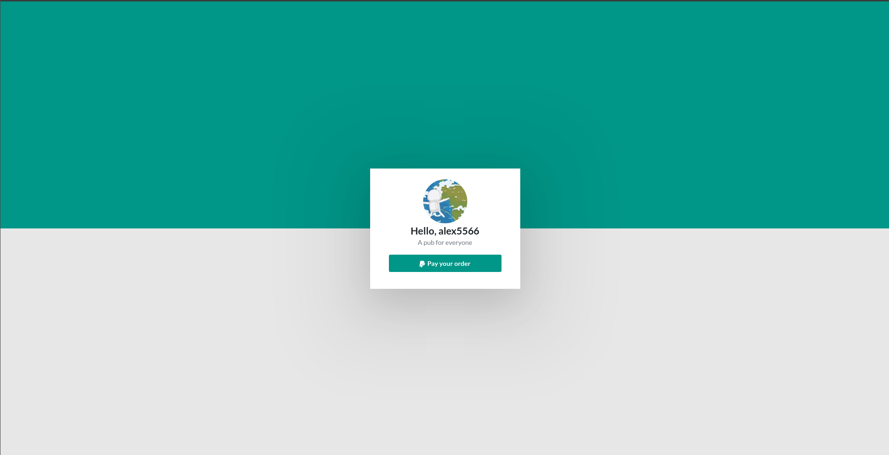
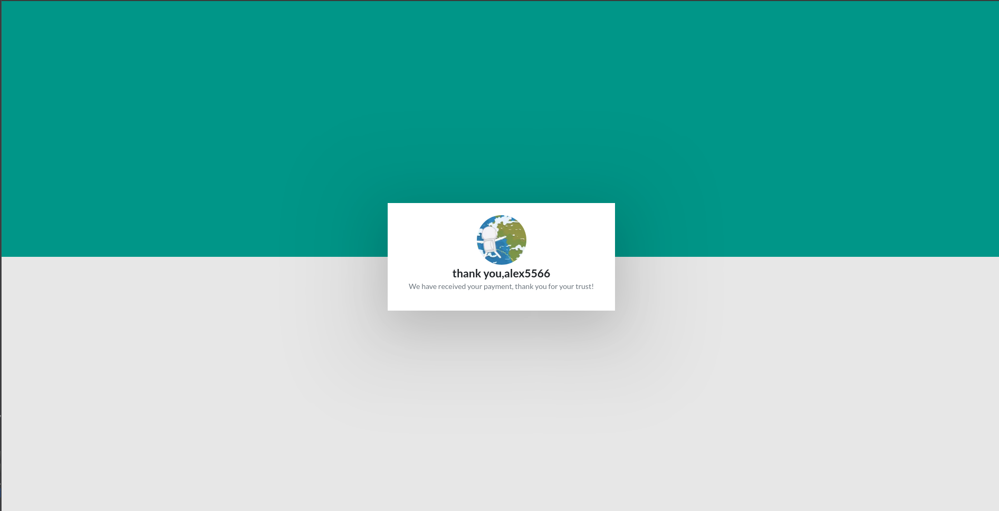

(Do note, I did not made this myself, I just translated it from [here](https://github.com/Androz2091/paypal-bot))

# Paypal Bot

## Steps

### Generate the Generate the invoice

To generate an invoice, use the `! Create` command on Discord.
Usage: `! Create [@user] [amount] [name]`
> Only the user ID defined in the config as owner (DISCORD_OWNER) can execute this command.

### Receive the invoice

Once the order is typed, the mentioned user receives a message with a link to pay:

### Pay the invoice

When the user clicks on this link, he is redirected to this page with his nickname, his avatar, the name of the invoice and the pay button:

When the user clicks on "Pay the order", he is redirected to Paypal.

### Confirmation of invoice payment

When the invoice is paid, the member is redirected to this page:

and receives this message on Discord:

### Invoice logs

For administration, a log system is available:

## Config

`DISCORD_TOKEN`: your Discord bot token
`DISCORD_PREFIX`: the bot prefix
`DISCORD_OWNER`: the user ID of the bot owner
`DISCORD_LOGS_CHANNEL`: the log room ID

`BASE_URL`: the base of the web server URL (for the example: `http://localhost:3200`)

`PAYPAL_USERNAME`, `PAYPAL_PASSWORD` and `PAYPAL_SIGNATURE` can be found by following [these instructions](https://www.npmjs.com/package/paypal-express-checkout#paypal-account).
